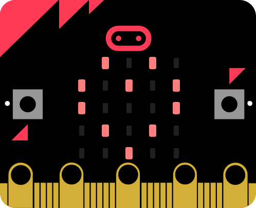
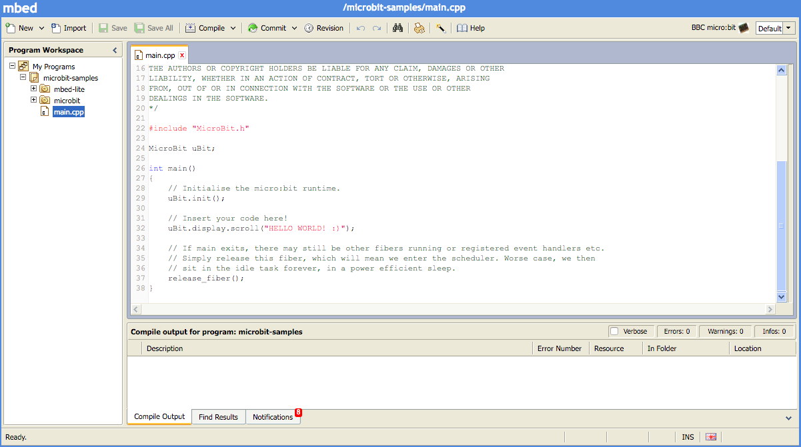

#Web-based C/C++ environments supporting the runtime

| Online compiler | Description |
| --- |-------------|
|  | ARM mbed has an online IDE for C/C++ development available at [http://developer.mbed.org](http://developer.mbed.org). It is free to use and the BBC micro:bit is one of its officially supported platforms. This online IDE provides a simple interface for writing, compiling and sharing projects like the micro:bit DAL, which is based on the [mbed SDK](https://github.com/mbedmicro/mbed). |

#Our friends using the runtime

| Language | Description |
| ------------- |-------------|
| 

 | The Microsoft Programming Experience Toolkit (PXT) provides a programming experience based around JavaScript. The experience has a built-in progression from simple block-based editor, through in-browser text editor with robust auto-completion and auto-fixing, all the way to a professional integrated development environment, Visual Studio Code. |
| 
 
 | With its touch-based interface, Touch Develop has been designed for mobile devices with touchscreens. It can also be used with a pc, keyboard and mouse. Touch Develop introduces a statically-typed scripting language with syntax-directed editor. It can be used to produce web-based apps that can run online on any platform. |
| 

 | The Block Editor is a visual editor and provides an introduction to structured programming via drag and drop coding blocks that snap together. You can also convert a Block Editor script into a Touch Develop script which helps with the transition to text-based programming. |
| 

 | Code Kingdoms is a visual JavaScript editor. It has a drag-and-drop interface making it accessible to beginners. You can also change from the visual editor to a text-based editor which supports the transition to text-based programming as the learner’s coding skills progress. |
| 

 | MicroPython is a completely text-based editor, perfect for those who want to push their coding skills further. A selection of 'snippets' are on hand to help auto-complete trickier tasks and a range of premade images and music are built-in to give you a helping hand with your code. |

# mbed

ARM mbed has an online IDE for C/C++ development available at [http://developer.mbed.org](http://developer.mbed.org). It is free to use and the BBC micro:bit is one of its officially supported platforms.

The online IDE provides a simple interface for writing, compiling and sharing projects like the micro:bit DAL, which is based on the [mbed SDK](https://github.com/mbedmicro/mbed).

### Getting started with mbed.org

<iframe width="560" height="315" src="https://www.youtube.com/embed/L5TcmFFD0iw?list=PLiVCejcvpsetJ1n9nRXzLWvE4dp4RwGOf" frameborder="0" allowfullscreen></iframe>

## Hello World on mbed.org

1. Create an account on [developer.mbed.org](https://developer.mbed.org/account/signup).

1. Visit the [micro:bit platform page](https://developer.mbed.org/platforms/Microbit/) and *add the micro:bit to your compiler* by clicking the "Add to your mbed compiler" button in the right hand sidebar.

1. Go to the [microbit-samples](https://developer.mbed.org/teams/Lancaster-University/code/microbit-samples/?platform=Microbit) project, and click the `Import this program` button for that project. The online IDE will open.

1. Complete the import of the project and then select it in the sidebar and click the `Compile` button. The build will start. The first build will take longer than subsequent builds.

1. Your browser will prompt you to download a file. Save this file locally, then drag and drop it onto your micro:bit. The copy triggers the orange LED on the back of the micro:bit to flash; it will stop flashing when the download is complete.

1. When the copy process finishes, the micro:bit drive will reset and disconnect from your computer. At this point, your code will also start running!

There is a more detailed guide for using the micro:bit in mbed on the [Lancaster-University team wiki on mbed](https://developer.mbed.org/teams/Lancaster-University/wiki/MicrobitGettingStarted)
