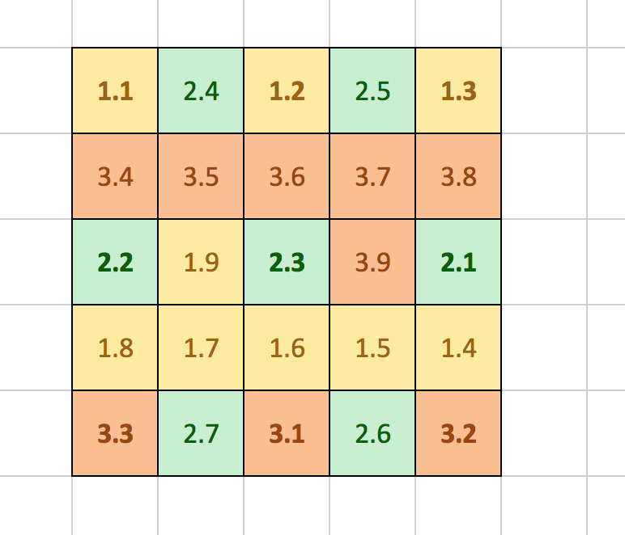

#uBit.display

## Overview

The MicroBitDisplay class is a general purpose device driver for controlling LED matrix displays.
LED matrix displays are simple, inexpensive devices that use a single LED as a display pixel. They therefore
tend to be of relatively low resolution, but often provide visually attractive displays due to the high coherence and brightness
of the LEDs.

LEDs in matrix displays are connected to general purpose I/O (GPIO) pins on CPU. Although they *could* be connected such that each
LED has its own GPIO pin, this is not usually the case, as the scarce resource of GPIO pins would soon be used up.  For example,
on the micro:bit, the LED matrix has 25 LEDs. If this required 25 GPIO pins, then there would be none left for anything else!

Instead, these LEDs are controlled by 12 GPIO pins. Three of those pins provide power to LEDs, the other
nine provide a route to ground. The pins that source power are called **rows**. The pins that sink power are called **columns**.
The following diagram shows how the 5x5 grid is connected into 3 logical 'rows' and 9 'columns':


<center>*Where the format is: **ROW**.**COLUMN***</center>

So, if we wanted to light up the middle LED, we would need to put a HIGH voltage (logic 1) on row 2, and a LOW voltage (logic 0) on column 3. Notice that when row 2 is
HIGH, we the value we write to the 9 column pins affect all of the LEDs 2.1 to 2.7, without affecting any of the LEDS on row 1 or row 3. Sharing GPIO pins in this way is known as multiplexing.
Moreover, if we scan through the different rows fast enough - faster than the eye can see - then we can provide the illusion of all the LEDS being on at the same time! This is a technique
known as *persistence of vision*... and was also the same basis of the very first TV sets (although that did not use LEDs!).

## Capabilities

The MicroBitDisplay class provides a driver for a general purpose matrix display, and also several high level features that make creating animations and visual effects on the
micro:bit LED display easy and fun! This class lets you:

 - Control the LED matrix on the micro:bit.
 - Use an optimised typeface (font) so you can show upper and lower case letters, numbers of symbols on the display.
 - Set Display wide or *per-pixel* brightness control up to 256 levels per pixel.
 - Create, move, paste and animate images.
 - Scroll and print images and text.
 - Access the screen buffer directly, so you can manipulate individual pixels.

## Using the Display

When using the uBit object, the display is automatically set up, and ready for you to use. Use any or all of the functions listed in the API section below to create effects on the
LED display. Here are a few examples to get you started though!

### Scrolling Text
Simply use the scroll function to specify the message you want to scroll, and sit back and watch the result. The message you provide will be scrolled, pixel by pixel across the display from right to left.
If you take a look at the documentation for the scroll function in the API below, you will notice that you can also specify the speed of the scroll as an optional final parameter. The lower the delay, the
faster your text will scroll across the screen.

```cpp
uBit.display.scroll("HELLO!");
uBit.display.scroll("HELLO!", 100);
```

Notice that you can also scroll numbers (either constants of variables):
```cpp
int c = 42;
uBit.display.scroll(c);
```

### Printing Text
Sometimes it is better to show the letters/numbers in turn on the screen rather than scrolling them. If you want to do this, the 'print' function has exactly the same parameters as 'scroll', but
with this behaviour.  e.g.

```cpp
uBit.display.print("HELLO!");
uBit.display.print("HELLO!", 100);
uBit.display.print(42);
```

Do notice that print behaves slightly differently if you provide a single character or numeric digit though. if you do this, the value you provide will stay on the screen until you explicitly
change the screen. If you ask the runtime to print a string with two or more characters, then each will appear in turn, then disappear. e.g. try this and you will find it stays on the screen:

```cpp
uBit.display.print(7);
```

### Showing Images
It is also possible to print and scroll bitmap images on the display. Images are represented in the runtime by using a [MicroBitImage](../data-types/image.md). These can easily be created, just as
you create any variable. Once created, you can then provide them as a parameter to the scroll and print functions. Unlike the text based animation functions, you can also specify exactly
where in the screen you would like the image to appear - and you can even treat pixel values of zero as transparent if you like!
See the [MicroBitImage page](../data-types/image.md) for more details on images, but here are a few simple examples:


```cpp
// show your smiley on the screen...
MicroBitImage smiley("0,255,0,255, 0\n0,255,0,255,0\n0,0,0,0,0\n255,0,0,0,255\n0,255,255,255,0\n");
uBit.display.print(smiley);
```

```cpp
// make your smiley peep up from the bottom of the screen...
MicroBitImage smiley("0,255,0,255, 0\n0,255,0,255,0\n0,0,0,0,0\n255,0,0,0,255\n0,255,255,255,0\n");
for (int y=4; y >= 0; y--)
{
    uBit.display.image.paste(smiley,0,y);
    uBit.sleep(500);
}
```

```cpp
// scroll your smiley across the screen...
MicroBitImage smiley("0,255,0,255, 0\n0,255,0,255,0\n0,0,0,0,0\n255,0,0,0,255\n0,255,255,255,0\n");
uBit.display.scroll(smiley);
```

### Running in the Background...
By now you have probably noticed that the scroll, print and animate functions all wait for the effect requested to finishes before returning. This is by design, to allow you to easily synchronise your programs.
However, sometimes you want to launch an effect, and let it run in the background while your program does something else. For this, you can use the *Async* variations of the scroll, print and animate functions.
These all have identical parameters and capabilities, but will return immediately. Try some of the examples above with their Async equivalents to understand this different behaviour.  For example:

```cpp
// scroll your smiley across the screen, without waiting for it to finish...
MicroBitImage smiley("0,255,0,255, 0\n0,255,0,255,0\n0,0,0,0,0\n255,0,0,0,255\n0,255,255,255,0\n");
uBit.display.scrollAsync(smiley);
```


### Changing Display Mode

The MicroBitDisplay class supports either on/off LED display, or displays where each pixel has an individual brightness value between 0 and 255. The former costs much less processor time and battery power to
operate, so it is the default. The latter does provide more useful effects though, so you can change between these modes by using the  'setDiplayMode' function. Valid values are:


| Display mode | Brief Description |
| ------------- |-------------|
| DISPLAY_MODE_BLACK_AND_WHITE | Each pixel can be just on or off. The brightness of all pixels is controlled by the setBrightness function. |
| DISPLAY_MODE_BLACK_AND_WHITE_LIGHT_SENSE | Each pixel can be just on or off, and the display driver will also sense the ambient brightness from the LEDs. |
| DISPLAY_MODE_GREYSCALE | Each pixel can independently have 256 levels of brightness. |

for example:

```cpp
// show a smiley with bright eyes!
MicroBitImage smiley("0,255,0,255, 0\n0,255,0,255,0\n0,0,0,0,0\n32,0,0,0,32\n0,32,32,32,0\n");
uBit.display.setDisplayMode(DISPLAY_MODE_GREYSCALE);
uBit.display.print(smiley);
```

### Accessing the Display Buffer

The memory buffer that is used to drive the LEDs is itself a [MicroBitImage](../data-types/image.md). This means that you can also access and call any of the functions listed in the [MicroBitImage API documentation](../data-types/image.md)
directly on the display buffer. Examples here include setPixelValue, as illustrated below, but read the above documentation link for full details.

```cpp
// set a single pixel by co-ordinate
uBit.display.image.setPixelValue(2,2,255);
```

### Other Useful Functions

 - 'clear' will clear the screen immediately.
 - 'stopAnimation' will terminate any on-going print, scroll or animate functions.
 - 'setBrightness' lets you set the overall maximum brightness of the display, as a value between 1 and 255.
 - 'enable' and 'disable' turn on and off the display. When disabled, you can reuse many if the GPIO pins. See the [MicroBitIO](io.md) class for more information.
 - 'rotateTo' even lets you specify the orientation of the display - in case you need to use your micro:bit the wrong way up. :-)
 - 'readLightLevel' runs the LEDs backwards as photodiodes and tells you how bright your room is... see [Light Sensing](../extras/light-sensing.md) for more info!


##Message Bus ID

| Constant | Value |
| ------------- |-------------|
| MICROBIT_ID_DISPLAY | 6 |

##Message Bus Events

| Constant | Value |
| ------------- |-------------|
| MICROBIT_DISPLAY_EVT_ANIMATION_COMPLETE | 1 |
| MICROBIT_DISPLAY_EVT_LIGHT_SENSE | 2 |

## Notify Events

These events use the notification channel `MICROBIT_ID_NOTIFY`, which provides
general purpose synchronisation.

| Constant | Value |
| ------------- |-------------|
| MICROBIT_DISPLAY_EVT_FREE | 1 |

##API
[comment]: <> ({"className":"MicroBitDisplay"})
##Constructor
<br/>
####MicroBitDisplay()
#####Description
Constructor.  

 Create a software representation the micro:bit's 5x5 LED matrix. The display is initially blank.  

 


#####Example
```cpp
 MicroBitDisplay display; 
```
<br/>
####MicroBitDisplay( <div style='color:#a71d5d; display:inline-block'>uint16_t</div> id)
#####Description
Constructor.  

 Create a software representation the micro:bit's 5x5 LED matrix. The display is initially blank.  

 


#####Parameters

>  <div style='color:#a71d5d; display:inline-block'>uint16_t</div> id - The id the display should use when sending events on the MessageBus. Defaults to MICROBIT_ID_DISPLAY.
#####Example
```cpp
 MicroBitDisplay display; 
```
<br/>
####MicroBitDisplay( <div style='color:#a71d5d; display:inline-block'>uint16_t</div> id,  <div style='color:#a71d5d; display:inline-block'>const  MatrixMap  &</div> map)
#####Description
Constructor.  

 Create a software representation the micro:bit's 5x5 LED matrix. The display is initially blank.  

 


#####Parameters

>  <div style='color:#a71d5d; display:inline-block'>uint16_t</div> id - The id the display should use when sending events on the MessageBus. Defaults to MICROBIT_ID_DISPLAY.

>  <div style='color:#a71d5d; display:inline-block'>const  MatrixMap  &</div> map - The mapping information that relates pin inputs/outputs to physical screen coordinates. Defaults to microbitMatrixMap, defined in  MicroBitMatrixMaps.h .
#####Example
```cpp
 MicroBitDisplay display; 
```
##stopAnimation
<br/>
####<div style='color:#a71d5d; display:inline-block'>void</div> <div style='color:#795da3; display:inline-block'>stopAnimation</div>()
#####Description
Stops any currently running animation, and any that are waiting to be displayed.           


##printCharAsync
<br/>
####<div style='color:#a71d5d; display:inline-block'>int</div> <div style='color:#795da3; display:inline-block'>printCharAsync</div>( <div style='color:#a71d5d; display:inline-block'>char</div> c)
#####Description
Prints the given character to the display, if it is not in use.  

 


#####Parameters

>  <div style='color:#a71d5d; display:inline-block'>char</div> c - The character to display.
#####Returns
MICROBIT_OK, MICROBIT_BUSY is the screen is in use, or MICROBIT_INVALID_PARAMETER.
#####Example
```cpp
 display.printAsync('p'); 
 display.printAsync('p',100); 
```
<br/>
####<div style='color:#a71d5d; display:inline-block'>int</div> <div style='color:#795da3; display:inline-block'>printCharAsync</div>( <div style='color:#a71d5d; display:inline-block'>char</div> c,  <div style='color:#a71d5d; display:inline-block'>int</div> delay)
#####Description
Prints the given character to the display, if it is not in use.  

 


#####Parameters

>  <div style='color:#a71d5d; display:inline-block'>char</div> c - The character to display.

>  <div style='color:#a71d5d; display:inline-block'>int</div> delay - Optional parameter - the time for which to show the character. Zero displays the character forever, or until the Displays next use.
#####Returns
MICROBIT_OK, MICROBIT_BUSY is the screen is in use, or MICROBIT_INVALID_PARAMETER.
#####Example
```cpp
 display.printAsync('p'); 
 display.printAsync('p',100); 
```
##printAsync
<br/>
####<div style='color:#a71d5d; display:inline-block'>int</div> <div style='color:#795da3; display:inline-block'>printAsync</div>( <div style='color:#a71d5d; display:inline-block'>ManagedString</div> s)
#####Description
Prints the given  ManagedString  to the display, one character at a time. Returns immediately, and executes the animation asynchronously.  

 


#####Parameters

>  <div style='color:#a71d5d; display:inline-block'>ManagedString</div> s - The string to display.
#####Returns
MICROBIT_OK, or MICROBIT_INVALID_PARAMETER.
#####Example
```cpp
 display.printAsync("abc123",400); 
```
<br/>
####<div style='color:#a71d5d; display:inline-block'>int</div> <div style='color:#795da3; display:inline-block'>printAsync</div>( <div style='color:#a71d5d; display:inline-block'>ManagedString</div> s,  <div style='color:#a71d5d; display:inline-block'>int</div> delay)
#####Description
Prints the given  ManagedString  to the display, one character at a time. Returns immediately, and executes the animation asynchronously.  

 


#####Parameters

>  <div style='color:#a71d5d; display:inline-block'>ManagedString</div> s - The string to display.

>  <div style='color:#a71d5d; display:inline-block'>int</div> delay - The time to delay between characters, in milliseconds. Must be > 0. Defaults to: MICROBIT_DEFAULT_PRINT_SPEED.
#####Returns
MICROBIT_OK, or MICROBIT_INVALID_PARAMETER.
#####Example
```cpp
 display.printAsync("abc123",400); 
```
<br/>
####<div style='color:#a71d5d; display:inline-block'>int</div> <div style='color:#795da3; display:inline-block'>printAsync</div>( <div style='color:#a71d5d; display:inline-block'>MicroBitImage</div> i)
#####Description
Prints the given image to the display, if the display is not in use. Returns immediately, and executes the animation asynchronously.  

 


#####Parameters

>  <div style='color:#a71d5d; display:inline-block'>MicroBitImage</div> i - The image to display.
#####Example
```cpp
 MicrobitImage i("1,1,1,1,1\n1,1,1,1,1\n"); 
 display.print(i,400); 
```
<br/>
####<div style='color:#a71d5d; display:inline-block'>int</div> <div style='color:#795da3; display:inline-block'>printAsync</div>( <div style='color:#a71d5d; display:inline-block'>MicroBitImage</div> i,  <div style='color:#a71d5d; display:inline-block'>int</div> x)
#####Description
Prints the given image to the display, if the display is not in use. Returns immediately, and executes the animation asynchronously.  

 


#####Parameters

>  <div style='color:#a71d5d; display:inline-block'>MicroBitImage</div> i - The image to display.

>  <div style='color:#a71d5d; display:inline-block'>int</div> x - The horizontal position on the screen to display the image. Defaults to 0.
#####Example
```cpp
 MicrobitImage i("1,1,1,1,1\n1,1,1,1,1\n"); 
 display.print(i,400); 
```
<br/>
####<div style='color:#a71d5d; display:inline-block'>int</div> <div style='color:#795da3; display:inline-block'>printAsync</div>( <div style='color:#a71d5d; display:inline-block'>MicroBitImage</div> i,  <div style='color:#a71d5d; display:inline-block'>int</div> x,  <div style='color:#a71d5d; display:inline-block'>int</div> y)
#####Description
Prints the given image to the display, if the display is not in use. Returns immediately, and executes the animation asynchronously.  

 


#####Parameters

>  <div style='color:#a71d5d; display:inline-block'>MicroBitImage</div> i - The image to display.

>  <div style='color:#a71d5d; display:inline-block'>int</div> x - The horizontal position on the screen to display the image. Defaults to 0.

>  <div style='color:#a71d5d; display:inline-block'>int</div> y - The vertical position on the screen to display the image. Defaults to 0.
#####Example
```cpp
 MicrobitImage i("1,1,1,1,1\n1,1,1,1,1\n"); 
 display.print(i,400); 
```
<br/>
####<div style='color:#a71d5d; display:inline-block'>int</div> <div style='color:#795da3; display:inline-block'>printAsync</div>( <div style='color:#a71d5d; display:inline-block'>MicroBitImage</div> i,  <div style='color:#a71d5d; display:inline-block'>int</div> x,  <div style='color:#a71d5d; display:inline-block'>int</div> y,  <div style='color:#a71d5d; display:inline-block'>int</div> alpha)
#####Description
Prints the given image to the display, if the display is not in use. Returns immediately, and executes the animation asynchronously.  

 


#####Parameters

>  <div style='color:#a71d5d; display:inline-block'>MicroBitImage</div> i - The image to display.

>  <div style='color:#a71d5d; display:inline-block'>int</div> x - The horizontal position on the screen to display the image. Defaults to 0.

>  <div style='color:#a71d5d; display:inline-block'>int</div> y - The vertical position on the screen to display the image. Defaults to 0.

>  <div style='color:#a71d5d; display:inline-block'>int</div> alpha - Treats the brightness level '0' as transparent. Defaults to 0.
#####Example
```cpp
 MicrobitImage i("1,1,1,1,1\n1,1,1,1,1\n"); 
 display.print(i,400); 
```
<br/>
####<div style='color:#a71d5d; display:inline-block'>int</div> <div style='color:#795da3; display:inline-block'>printAsync</div>( <div style='color:#a71d5d; display:inline-block'>MicroBitImage</div> i,  <div style='color:#a71d5d; display:inline-block'>int</div> x,  <div style='color:#a71d5d; display:inline-block'>int</div> y,  <div style='color:#a71d5d; display:inline-block'>int</div> alpha,  <div style='color:#a71d5d; display:inline-block'>int</div> delay)
#####Description
Prints the given image to the display, if the display is not in use. Returns immediately, and executes the animation asynchronously.  

 


#####Parameters

>  <div style='color:#a71d5d; display:inline-block'>MicroBitImage</div> i - The image to display.

>  <div style='color:#a71d5d; display:inline-block'>int</div> x - The horizontal position on the screen to display the image. Defaults to 0.

>  <div style='color:#a71d5d; display:inline-block'>int</div> y - The vertical position on the screen to display the image. Defaults to 0.

>  <div style='color:#a71d5d; display:inline-block'>int</div> alpha - Treats the brightness level '0' as transparent. Defaults to 0.

>  <div style='color:#a71d5d; display:inline-block'>int</div> delay - The time to delay between characters, in milliseconds. Defaults to 0.
#####Example
```cpp
 MicrobitImage i("1,1,1,1,1\n1,1,1,1,1\n"); 
 display.print(i,400); 
```
##printChar
<br/>
####<div style='color:#a71d5d; display:inline-block'>int</div> <div style='color:#795da3; display:inline-block'>printChar</div>( <div style='color:#a71d5d; display:inline-block'>char</div> c)
#####Description
Prints the given character to the display.  

 


#####Parameters

>  <div style='color:#a71d5d; display:inline-block'>char</div> c - The character to display.
#####Returns
MICROBIT_OK, MICROBIT_CANCELLED or MICROBIT_INVALID_PARAMETER.
#####Example
```cpp
 display.printAsync('p'); 
 display.printAsync('p',100); 
```
<br/>
####<div style='color:#a71d5d; display:inline-block'>int</div> <div style='color:#795da3; display:inline-block'>printChar</div>( <div style='color:#a71d5d; display:inline-block'>char</div> c,  <div style='color:#a71d5d; display:inline-block'>int</div> delay)
#####Description
Prints the given character to the display.  

 


#####Parameters

>  <div style='color:#a71d5d; display:inline-block'>char</div> c - The character to display.

>  <div style='color:#a71d5d; display:inline-block'>int</div> delay - Optional parameter - the time for which to show the character. Zero displays the character forever, or until the Displays next use.
#####Returns
MICROBIT_OK, MICROBIT_CANCELLED or MICROBIT_INVALID_PARAMETER.
#####Example
```cpp
 display.printAsync('p'); 
 display.printAsync('p',100); 
```
##print
<br/>
####<div style='color:#a71d5d; display:inline-block'>int</div> <div style='color:#795da3; display:inline-block'>print</div>( <div style='color:#a71d5d; display:inline-block'>ManagedString</div> s)
#####Description
Prints the given string to the display, one character at a time.  

 Blocks the calling thread until all the text has been displayed.  

 


#####Parameters

>  <div style='color:#a71d5d; display:inline-block'>ManagedString</div> s - The string to display.
#####Returns
MICROBIT_OK, MICROBIT_CANCELLED or MICROBIT_INVALID_PARAMETER.
#####Example
```cpp
 display.print("abc123",400); 
```
<br/>
####<div style='color:#a71d5d; display:inline-block'>int</div> <div style='color:#795da3; display:inline-block'>print</div>( <div style='color:#a71d5d; display:inline-block'>ManagedString</div> s,  <div style='color:#a71d5d; display:inline-block'>int</div> delay)
#####Description
Prints the given string to the display, one character at a time.  

 Blocks the calling thread until all the text has been displayed.  

 


#####Parameters

>  <div style='color:#a71d5d; display:inline-block'>ManagedString</div> s - The string to display.

>  <div style='color:#a71d5d; display:inline-block'>int</div> delay - The time to delay between characters, in milliseconds. Defaults to: MICROBIT_DEFAULT_PRINT_SPEED.
#####Returns
MICROBIT_OK, MICROBIT_CANCELLED or MICROBIT_INVALID_PARAMETER.
#####Example
```cpp
 display.print("abc123",400); 
```
<br/>
####<div style='color:#a71d5d; display:inline-block'>int</div> <div style='color:#795da3; display:inline-block'>print</div>( <div style='color:#a71d5d; display:inline-block'>MicroBitImage</div> i)
#####Description
Prints the given image to the display. Blocks the calling thread until all the image has been displayed.  

 


#####Parameters

>  <div style='color:#a71d5d; display:inline-block'>MicroBitImage</div> i - The image to display.
#####Returns
MICROBIT_OK, MICROBIT_BUSY if the display is already in use, or MICROBIT_INVALID_PARAMETER.
#####Example
```cpp
 MicrobitImage i("1,1,1,1,1\n1,1,1,1,1\n"); 
 display.print(i,400); 
```
<br/>
####<div style='color:#a71d5d; display:inline-block'>int</div> <div style='color:#795da3; display:inline-block'>print</div>( <div style='color:#a71d5d; display:inline-block'>MicroBitImage</div> i,  <div style='color:#a71d5d; display:inline-block'>int</div> x)
#####Description
Prints the given image to the display. Blocks the calling thread until all the image has been displayed.  

 


#####Parameters

>  <div style='color:#a71d5d; display:inline-block'>MicroBitImage</div> i - The image to display.

>  <div style='color:#a71d5d; display:inline-block'>int</div> x - The horizontal position on the screen to display the image. Defaults to 0.
#####Returns
MICROBIT_OK, MICROBIT_BUSY if the display is already in use, or MICROBIT_INVALID_PARAMETER.
#####Example
```cpp
 MicrobitImage i("1,1,1,1,1\n1,1,1,1,1\n"); 
 display.print(i,400); 
```
<br/>
####<div style='color:#a71d5d; display:inline-block'>int</div> <div style='color:#795da3; display:inline-block'>print</div>( <div style='color:#a71d5d; display:inline-block'>MicroBitImage</div> i,  <div style='color:#a71d5d; display:inline-block'>int</div> x,  <div style='color:#a71d5d; display:inline-block'>int</div> y)
#####Description
Prints the given image to the display. Blocks the calling thread until all the image has been displayed.  

 


#####Parameters

>  <div style='color:#a71d5d; display:inline-block'>MicroBitImage</div> i - The image to display.

>  <div style='color:#a71d5d; display:inline-block'>int</div> x - The horizontal position on the screen to display the image. Defaults to 0.

>  <div style='color:#a71d5d; display:inline-block'>int</div> y - The vertical position on the screen to display the image. Defaults to 0.
#####Returns
MICROBIT_OK, MICROBIT_BUSY if the display is already in use, or MICROBIT_INVALID_PARAMETER.
#####Example
```cpp
 MicrobitImage i("1,1,1,1,1\n1,1,1,1,1\n"); 
 display.print(i,400); 
```
<br/>
####<div style='color:#a71d5d; display:inline-block'>int</div> <div style='color:#795da3; display:inline-block'>print</div>( <div style='color:#a71d5d; display:inline-block'>MicroBitImage</div> i,  <div style='color:#a71d5d; display:inline-block'>int</div> x,  <div style='color:#a71d5d; display:inline-block'>int</div> y,  <div style='color:#a71d5d; display:inline-block'>int</div> alpha)
#####Description
Prints the given image to the display. Blocks the calling thread until all the image has been displayed.  

 


#####Parameters

>  <div style='color:#a71d5d; display:inline-block'>MicroBitImage</div> i - The image to display.

>  <div style='color:#a71d5d; display:inline-block'>int</div> x - The horizontal position on the screen to display the image. Defaults to 0.

>  <div style='color:#a71d5d; display:inline-block'>int</div> y - The vertical position on the screen to display the image. Defaults to 0.

>  <div style='color:#a71d5d; display:inline-block'>int</div> alpha - Treats the brightness level '0' as transparent. Defaults to 0.
#####Returns
MICROBIT_OK, MICROBIT_BUSY if the display is already in use, or MICROBIT_INVALID_PARAMETER.
#####Example
```cpp
 MicrobitImage i("1,1,1,1,1\n1,1,1,1,1\n"); 
 display.print(i,400); 
```
<br/>
####<div style='color:#a71d5d; display:inline-block'>int</div> <div style='color:#795da3; display:inline-block'>print</div>( <div style='color:#a71d5d; display:inline-block'>MicroBitImage</div> i,  <div style='color:#a71d5d; display:inline-block'>int</div> x,  <div style='color:#a71d5d; display:inline-block'>int</div> y,  <div style='color:#a71d5d; display:inline-block'>int</div> alpha,  <div style='color:#a71d5d; display:inline-block'>int</div> delay)
#####Description
Prints the given image to the display. Blocks the calling thread until all the image has been displayed.  

 


#####Parameters

>  <div style='color:#a71d5d; display:inline-block'>MicroBitImage</div> i - The image to display.

>  <div style='color:#a71d5d; display:inline-block'>int</div> x - The horizontal position on the screen to display the image. Defaults to 0.

>  <div style='color:#a71d5d; display:inline-block'>int</div> y - The vertical position on the screen to display the image. Defaults to 0.

>  <div style='color:#a71d5d; display:inline-block'>int</div> alpha - Treats the brightness level '0' as transparent. Defaults to 0.

>  <div style='color:#a71d5d; display:inline-block'>int</div> delay - The time to display the image for, or zero to show the image forever. Defaults to 0.
#####Returns
MICROBIT_OK, MICROBIT_BUSY if the display is already in use, or MICROBIT_INVALID_PARAMETER.
#####Example
```cpp
 MicrobitImage i("1,1,1,1,1\n1,1,1,1,1\n"); 
 display.print(i,400); 
```
##scrollAsync
<br/>
####<div style='color:#a71d5d; display:inline-block'>int</div> <div style='color:#795da3; display:inline-block'>scrollAsync</div>( <div style='color:#a71d5d; display:inline-block'>ManagedString</div> s)
#####Description
Scrolls the given string to the display, from right to left. Returns immediately, and executes the animation asynchronously.  

 


#####Parameters

>  <div style='color:#a71d5d; display:inline-block'>ManagedString</div> s - The string to display.
#####Returns
MICROBIT_OK, MICROBIT_BUSY if the display is already in use, or MICROBIT_INVALID_PARAMETER.
#####Example
```cpp
 display.scrollAsync("abc123",100); 
```
<br/>
####<div style='color:#a71d5d; display:inline-block'>int</div> <div style='color:#795da3; display:inline-block'>scrollAsync</div>( <div style='color:#a71d5d; display:inline-block'>ManagedString</div> s,  <div style='color:#a71d5d; display:inline-block'>int</div> delay)
#####Description
Scrolls the given string to the display, from right to left. Returns immediately, and executes the animation asynchronously.  

 


#####Parameters

>  <div style='color:#a71d5d; display:inline-block'>ManagedString</div> s - The string to display.

>  <div style='color:#a71d5d; display:inline-block'>int</div> delay - The time to delay between characters, in milliseconds. Defaults to: MICROBIT_DEFAULT_SCROLL_SPEED.
#####Returns
MICROBIT_OK, MICROBIT_BUSY if the display is already in use, or MICROBIT_INVALID_PARAMETER.
#####Example
```cpp
 display.scrollAsync("abc123",100); 
```
<br/>
####<div style='color:#a71d5d; display:inline-block'>int</div> <div style='color:#795da3; display:inline-block'>scrollAsync</div>( <div style='color:#a71d5d; display:inline-block'>MicroBitImage</div> image)
#####Description
Scrolls the given image across the display, from right to left. Returns immediately, and executes the animation asynchronously.  

 


#####Parameters

>  <div style='color:#a71d5d; display:inline-block'>MicroBitImage</div> image - The image to display.
#####Returns
MICROBIT_OK, MICROBIT_BUSY if the display is already in use, or MICROBIT_INVALID_PARAMETER.
#####Example
```cpp
 MicrobitImage i("1,1,1,1,1\n1,1,1,1,1\n"); 
 display.scrollAsync(i,100,1); 
```
<br/>
####<div style='color:#a71d5d; display:inline-block'>int</div> <div style='color:#795da3; display:inline-block'>scrollAsync</div>( <div style='color:#a71d5d; display:inline-block'>MicroBitImage</div> image,  <div style='color:#a71d5d; display:inline-block'>int</div> delay)
#####Description
Scrolls the given image across the display, from right to left. Returns immediately, and executes the animation asynchronously.  

 


#####Parameters

>  <div style='color:#a71d5d; display:inline-block'>MicroBitImage</div> image - The image to display.

>  <div style='color:#a71d5d; display:inline-block'>int</div> delay - The time between updates, in milliseconds. Defaults to: MICROBIT_DEFAULT_SCROLL_SPEED.
#####Returns
MICROBIT_OK, MICROBIT_BUSY if the display is already in use, or MICROBIT_INVALID_PARAMETER.
#####Example
```cpp
 MicrobitImage i("1,1,1,1,1\n1,1,1,1,1\n"); 
 display.scrollAsync(i,100,1); 
```
<br/>
####<div style='color:#a71d5d; display:inline-block'>int</div> <div style='color:#795da3; display:inline-block'>scrollAsync</div>( <div style='color:#a71d5d; display:inline-block'>MicroBitImage</div> image,  <div style='color:#a71d5d; display:inline-block'>int</div> delay,  <div style='color:#a71d5d; display:inline-block'>int</div> stride)
#####Description
Scrolls the given image across the display, from right to left. Returns immediately, and executes the animation asynchronously.  

 


#####Parameters

>  <div style='color:#a71d5d; display:inline-block'>MicroBitImage</div> image - The image to display.

>  <div style='color:#a71d5d; display:inline-block'>int</div> delay - The time between updates, in milliseconds. Defaults to: MICROBIT_DEFAULT_SCROLL_SPEED.

>  <div style='color:#a71d5d; display:inline-block'>int</div> stride - The number of pixels to shift by in each update. Defaults to MICROBIT_DEFAULT_SCROLL_STRIDE.
#####Returns
MICROBIT_OK, MICROBIT_BUSY if the display is already in use, or MICROBIT_INVALID_PARAMETER.
#####Example
```cpp
 MicrobitImage i("1,1,1,1,1\n1,1,1,1,1\n"); 
 display.scrollAsync(i,100,1); 
```
##scroll
<br/>
####<div style='color:#a71d5d; display:inline-block'>int</div> <div style='color:#795da3; display:inline-block'>scroll</div>( <div style='color:#a71d5d; display:inline-block'>ManagedString</div> s)
#####Description
Scrolls the given string across the display, from right to left. Blocks the calling thread until all text has been displayed.  

 


#####Parameters

>  <div style='color:#a71d5d; display:inline-block'>ManagedString</div> s - The string to display.
#####Returns
MICROBIT_OK, MICROBIT_CANCELLED or MICROBIT_INVALID_PARAMETER.
#####Example
```cpp
 display.scroll("abc123",100); 
```
<br/>
####<div style='color:#a71d5d; display:inline-block'>int</div> <div style='color:#795da3; display:inline-block'>scroll</div>( <div style='color:#a71d5d; display:inline-block'>ManagedString</div> s,  <div style='color:#a71d5d; display:inline-block'>int</div> delay)
#####Description
Scrolls the given string across the display, from right to left. Blocks the calling thread until all text has been displayed.  

 


#####Parameters

>  <div style='color:#a71d5d; display:inline-block'>ManagedString</div> s - The string to display.

>  <div style='color:#a71d5d; display:inline-block'>int</div> delay - The time to delay between characters, in milliseconds. Defaults to: MICROBIT_DEFAULT_SCROLL_SPEED.
#####Returns
MICROBIT_OK, MICROBIT_CANCELLED or MICROBIT_INVALID_PARAMETER.
#####Example
```cpp
 display.scroll("abc123",100); 
```
<br/>
####<div style='color:#a71d5d; display:inline-block'>int</div> <div style='color:#795da3; display:inline-block'>scroll</div>( <div style='color:#a71d5d; display:inline-block'>MicroBitImage</div> image)
#####Description
Scrolls the given image across the display, from right to left. Blocks the calling thread until all the text has been displayed.  

 


#####Parameters

>  <div style='color:#a71d5d; display:inline-block'>MicroBitImage</div> image - The image to display.
#####Returns
MICROBIT_OK, MICROBIT_CANCELLED or MICROBIT_INVALID_PARAMETER.
#####Example
```cpp
 MicrobitImage i("1,1,1,1,1\n1,1,1,1,1\n"); 
 display.scroll(i,100,1); 
```
<br/>
####<div style='color:#a71d5d; display:inline-block'>int</div> <div style='color:#795da3; display:inline-block'>scroll</div>( <div style='color:#a71d5d; display:inline-block'>MicroBitImage</div> image,  <div style='color:#a71d5d; display:inline-block'>int</div> delay)
#####Description
Scrolls the given image across the display, from right to left. Blocks the calling thread until all the text has been displayed.  

 


#####Parameters

>  <div style='color:#a71d5d; display:inline-block'>MicroBitImage</div> image - The image to display.

>  <div style='color:#a71d5d; display:inline-block'>int</div> delay - The time between updates, in milliseconds. Defaults to: MICROBIT_DEFAULT_SCROLL_SPEED.
#####Returns
MICROBIT_OK, MICROBIT_CANCELLED or MICROBIT_INVALID_PARAMETER.
#####Example
```cpp
 MicrobitImage i("1,1,1,1,1\n1,1,1,1,1\n"); 
 display.scroll(i,100,1); 
```
<br/>
####<div style='color:#a71d5d; display:inline-block'>int</div> <div style='color:#795da3; display:inline-block'>scroll</div>( <div style='color:#a71d5d; display:inline-block'>MicroBitImage</div> image,  <div style='color:#a71d5d; display:inline-block'>int</div> delay,  <div style='color:#a71d5d; display:inline-block'>int</div> stride)
#####Description
Scrolls the given image across the display, from right to left. Blocks the calling thread until all the text has been displayed.  

 


#####Parameters

>  <div style='color:#a71d5d; display:inline-block'>MicroBitImage</div> image - The image to display.

>  <div style='color:#a71d5d; display:inline-block'>int</div> delay - The time between updates, in milliseconds. Defaults to: MICROBIT_DEFAULT_SCROLL_SPEED.

>  <div style='color:#a71d5d; display:inline-block'>int</div> stride - The number of pixels to shift by in each update. Defaults to MICROBIT_DEFAULT_SCROLL_STRIDE.
#####Returns
MICROBIT_OK, MICROBIT_CANCELLED or MICROBIT_INVALID_PARAMETER.
#####Example
```cpp
 MicrobitImage i("1,1,1,1,1\n1,1,1,1,1\n"); 
 display.scroll(i,100,1); 
```
##animateAsync
<br/>
####<div style='color:#a71d5d; display:inline-block'>int</div> <div style='color:#795da3; display:inline-block'>animateAsync</div>( <div style='color:#a71d5d; display:inline-block'>MicroBitImage</div> image,  <div style='color:#a71d5d; display:inline-block'>int</div> delay,  <div style='color:#a71d5d; display:inline-block'>int</div> stride)
#####Description
"Animates" the current image across the display with a given stride, finishing on the last frame of the animation. Returns immediately.  

 


#####Parameters

>  <div style='color:#a71d5d; display:inline-block'>MicroBitImage</div> image - The image to display.

>  <div style='color:#a71d5d; display:inline-block'>int</div> delay - The time to delay between each update of the display, in milliseconds.

>  <div style='color:#a71d5d; display:inline-block'>int</div> stride - The number of pixels to shift by in each update.
#####Returns
MICROBIT_OK, MICROBIT_BUSY if the screen is in use, or MICROBIT_INVALID_PARAMETER.
#####Example
```cpp
 const int heart_w = 10; 
 const int heart_h = 5; 
 const uint8_t heart[] = { 0, 1, 0, 1, 0, 0, 0, 0, 0, 0, 1, 1, 1, 1, 1, 0, 1, 0, 1, 0, 1, 1, 1, 1, 1, 0, 1, 1, 1, 0, 0, 1, 1, 1, 0, 0, 0, 1, 0, 0, 0, 0, 1, 0, 0, 0, 0, 0, 0, 0, }; 
 
 MicroBitImage i(heart_w,heart_h,heart); 
 display.animateAsync(i,100,5); 
```
<br/>
####<div style='color:#a71d5d; display:inline-block'>int</div> <div style='color:#795da3; display:inline-block'>animateAsync</div>( <div style='color:#a71d5d; display:inline-block'>MicroBitImage</div> image,  <div style='color:#a71d5d; display:inline-block'>int</div> delay,  <div style='color:#a71d5d; display:inline-block'>int</div> stride,  <div style='color:#a71d5d; display:inline-block'>int</div> startingPosition)
#####Description
"Animates" the current image across the display with a given stride, finishing on the last frame of the animation. Returns immediately.  

 


#####Parameters

>  <div style='color:#a71d5d; display:inline-block'>MicroBitImage</div> image - The image to display.

>  <div style='color:#a71d5d; display:inline-block'>int</div> delay - The time to delay between each update of the display, in milliseconds.

>  <div style='color:#a71d5d; display:inline-block'>int</div> stride - The number of pixels to shift by in each update.

>  <div style='color:#a71d5d; display:inline-block'>int</div> startingPosition - the starting position on the display for the animation to begin at. Defaults to MICROBIT_DISPLAY_ANIMATE_DEFAULT_POS.
#####Returns
MICROBIT_OK, MICROBIT_BUSY if the screen is in use, or MICROBIT_INVALID_PARAMETER.
#####Example
```cpp
 const int heart_w = 10; 
 const int heart_h = 5; 
 const uint8_t heart[] = { 0, 1, 0, 1, 0, 0, 0, 0, 0, 0, 1, 1, 1, 1, 1, 0, 1, 0, 1, 0, 1, 1, 1, 1, 1, 0, 1, 1, 1, 0, 0, 1, 1, 1, 0, 0, 0, 1, 0, 0, 0, 0, 1, 0, 0, 0, 0, 0, 0, 0, }; 
 
 MicroBitImage i(heart_w,heart_h,heart); 
 display.animateAsync(i,100,5); 
```
<br/>
####<div style='color:#a71d5d; display:inline-block'>int</div> <div style='color:#795da3; display:inline-block'>animateAsync</div>( <div style='color:#a71d5d; display:inline-block'>MicroBitImage</div> image,  <div style='color:#a71d5d; display:inline-block'>int</div> delay,  <div style='color:#a71d5d; display:inline-block'>int</div> stride,  <div style='color:#a71d5d; display:inline-block'>int</div> startingPosition,  <div style='color:#a71d5d; display:inline-block'>int</div> autoClear)
#####Description
"Animates" the current image across the display with a given stride, finishing on the last frame of the animation. Returns immediately.  

 


#####Parameters

>  <div style='color:#a71d5d; display:inline-block'>MicroBitImage</div> image - The image to display.

>  <div style='color:#a71d5d; display:inline-block'>int</div> delay - The time to delay between each update of the display, in milliseconds.

>  <div style='color:#a71d5d; display:inline-block'>int</div> stride - The number of pixels to shift by in each update.

>  <div style='color:#a71d5d; display:inline-block'>int</div> startingPosition - the starting position on the display for the animation to begin at. Defaults to MICROBIT_DISPLAY_ANIMATE_DEFAULT_POS.

>  <div style='color:#a71d5d; display:inline-block'>int</div> autoClear - defines whether or not the display is automatically cleared once the animation is complete. By default, the display is cleared. Set this parameter to zero to disable the autoClear operation.
#####Returns
MICROBIT_OK, MICROBIT_BUSY if the screen is in use, or MICROBIT_INVALID_PARAMETER.
#####Example
```cpp
 const int heart_w = 10; 
 const int heart_h = 5; 
 const uint8_t heart[] = { 0, 1, 0, 1, 0, 0, 0, 0, 0, 0, 1, 1, 1, 1, 1, 0, 1, 0, 1, 0, 1, 1, 1, 1, 1, 0, 1, 1, 1, 0, 0, 1, 1, 1, 0, 0, 0, 1, 0, 0, 0, 0, 1, 0, 0, 0, 0, 0, 0, 0, }; 
 
 MicroBitImage i(heart_w,heart_h,heart); 
 display.animateAsync(i,100,5); 
```
##animate
<br/>
####<div style='color:#a71d5d; display:inline-block'>int</div> <div style='color:#795da3; display:inline-block'>animate</div>( <div style='color:#a71d5d; display:inline-block'>MicroBitImage</div> image,  <div style='color:#a71d5d; display:inline-block'>int</div> delay,  <div style='color:#a71d5d; display:inline-block'>int</div> stride)
#####Description
"Animates" the current image across the display with a given stride, finishing on the last frame of the animation. Blocks the calling thread until the animation is complete.  

 


#####Parameters

>  <div style='color:#a71d5d; display:inline-block'>MicroBitImage</div> image

>  <div style='color:#a71d5d; display:inline-block'>int</div> delay - The time to delay between each update of the display, in milliseconds.

>  <div style='color:#a71d5d; display:inline-block'>int</div> stride - The number of pixels to shift by in each update.
#####Returns
MICROBIT_OK, MICROBIT_CANCELLED or MICROBIT_INVALID_PARAMETER.
#####Example
```cpp
 const int heart_w = 10; 
 const int heart_h = 5; 
 const uint8_t heart[] = { 0, 1, 0, 1, 0, 0, 0, 0, 0, 0, 1, 1, 1, 1, 1, 0, 1, 0, 1, 0, 1, 1, 1, 1, 1, 0, 1, 1, 1, 0, 0, 1, 1, 1, 0, 0, 0, 1, 0, 0, 0, 0, 1, 0, 0, 0, 0, 0, 0, 0, }; 
 
 MicroBitImage i(heart_w,heart_h,heart); 
 display.animate(i,100,5); 
```
<br/>
####<div style='color:#a71d5d; display:inline-block'>int</div> <div style='color:#795da3; display:inline-block'>animate</div>( <div style='color:#a71d5d; display:inline-block'>MicroBitImage</div> image,  <div style='color:#a71d5d; display:inline-block'>int</div> delay,  <div style='color:#a71d5d; display:inline-block'>int</div> stride,  <div style='color:#a71d5d; display:inline-block'>int</div> startingPosition)
#####Description
"Animates" the current image across the display with a given stride, finishing on the last frame of the animation. Blocks the calling thread until the animation is complete.  

 


#####Parameters

>  <div style='color:#a71d5d; display:inline-block'>MicroBitImage</div> image

>  <div style='color:#a71d5d; display:inline-block'>int</div> delay - The time to delay between each update of the display, in milliseconds.

>  <div style='color:#a71d5d; display:inline-block'>int</div> stride - The number of pixels to shift by in each update.

>  <div style='color:#a71d5d; display:inline-block'>int</div> startingPosition - the starting position on the display for the animation to begin at. Defaults to MICROBIT_DISPLAY_ANIMATE_DEFAULT_POS.
#####Returns
MICROBIT_OK, MICROBIT_CANCELLED or MICROBIT_INVALID_PARAMETER.
#####Example
```cpp
 const int heart_w = 10; 
 const int heart_h = 5; 
 const uint8_t heart[] = { 0, 1, 0, 1, 0, 0, 0, 0, 0, 0, 1, 1, 1, 1, 1, 0, 1, 0, 1, 0, 1, 1, 1, 1, 1, 0, 1, 1, 1, 0, 0, 1, 1, 1, 0, 0, 0, 1, 0, 0, 0, 0, 1, 0, 0, 0, 0, 0, 0, 0, }; 
 
 MicroBitImage i(heart_w,heart_h,heart); 
 display.animate(i,100,5); 
```
<br/>
####<div style='color:#a71d5d; display:inline-block'>int</div> <div style='color:#795da3; display:inline-block'>animate</div>( <div style='color:#a71d5d; display:inline-block'>MicroBitImage</div> image,  <div style='color:#a71d5d; display:inline-block'>int</div> delay,  <div style='color:#a71d5d; display:inline-block'>int</div> stride,  <div style='color:#a71d5d; display:inline-block'>int</div> startingPosition,  <div style='color:#a71d5d; display:inline-block'>int</div> autoClear)
#####Description
"Animates" the current image across the display with a given stride, finishing on the last frame of the animation. Blocks the calling thread until the animation is complete.  

 


#####Parameters

>  <div style='color:#a71d5d; display:inline-block'>MicroBitImage</div> image

>  <div style='color:#a71d5d; display:inline-block'>int</div> delay - The time to delay between each update of the display, in milliseconds.

>  <div style='color:#a71d5d; display:inline-block'>int</div> stride - The number of pixels to shift by in each update.

>  <div style='color:#a71d5d; display:inline-block'>int</div> startingPosition - the starting position on the display for the animation to begin at. Defaults to MICROBIT_DISPLAY_ANIMATE_DEFAULT_POS.

>  <div style='color:#a71d5d; display:inline-block'>int</div> autoClear - defines whether or not the display is automatically cleared once the animation is complete. By default, the display is cleared. Set this parameter to zero to disable the autoClear operation.
#####Returns
MICROBIT_OK, MICROBIT_CANCELLED or MICROBIT_INVALID_PARAMETER.
#####Example
```cpp
 const int heart_w = 10; 
 const int heart_h = 5; 
 const uint8_t heart[] = { 0, 1, 0, 1, 0, 0, 0, 0, 0, 0, 1, 1, 1, 1, 1, 0, 1, 0, 1, 0, 1, 1, 1, 1, 1, 0, 1, 1, 1, 0, 0, 1, 1, 1, 0, 0, 0, 1, 0, 0, 0, 0, 1, 0, 0, 0, 0, 0, 0, 0, }; 
 
 MicroBitImage i(heart_w,heart_h,heart); 
 display.animate(i,100,5); 
```
##setBrightness
<br/>
####<div style='color:#a71d5d; display:inline-block'>int</div> <div style='color:#795da3; display:inline-block'>setBrightness</div>( <div style='color:#a71d5d; display:inline-block'>int</div> b)
#####Description
Configures the brightness of the display.  

 


#####Parameters

>  <div style='color:#a71d5d; display:inline-block'>int</div> b - The brightness to set the brightness to, in the range 0 - 255.
#####Returns
MICROBIT_OK, or MICROBIT_INVALID_PARAMETER
#####Example
```cpp
 display.setBrightness(255); //max brightness 
```
##setDisplayMode
<br/>
####<div style='color:#a71d5d; display:inline-block'>void</div> <div style='color:#795da3; display:inline-block'>setDisplayMode</div>( <div style='color:#a71d5d; display:inline-block'>DisplayMode</div> mode)
#####Description
Configures the mode of the display.  

 


#####Parameters

>  <div style='color:#a71d5d; display:inline-block'>DisplayMode</div> mode - The mode to swap the display into. One of: DISPLAY_MODE_GREYSCALE, DISPLAY_MODE_BLACK_AND_WHITE, DISPLAY_MODE_BLACK_AND_WHITE_LIGHT_SENSE
#####Example
```cpp
 display.setDisplayMode(DISPLAY_MODE_GREYSCALE); //per pixel brightness 
```
##getDisplayMode
<br/>
####<div style='color:#a71d5d; display:inline-block'>int</div> <div style='color:#795da3; display:inline-block'>getDisplayMode</div>()
#####Description
Retrieves the mode of the display.  

 


#####Returns
the current mode of the display 
##getBrightness
<br/>
####<div style='color:#a71d5d; display:inline-block'>int</div> <div style='color:#795da3; display:inline-block'>getBrightness</div>()
#####Description
Fetches the current brightness of this display.  

 


#####Returns
the brightness of this display, in the range 0..255.
#####Example
```cpp
 display.getBrightness(); //the current brightness 
```
##rotateTo
<br/>
####<div style='color:#a71d5d; display:inline-block'>void</div> <div style='color:#795da3; display:inline-block'>rotateTo</div>( <div style='color:#a71d5d; display:inline-block'>DisplayRotation</div> position)
#####Description
Rotates the display to the given position.  

 Axis aligned values only.  

 


#####Parameters

>  <div style='color:#a71d5d; display:inline-block'>DisplayRotation</div> position
#####Example
```cpp
 display.rotateTo(MICROBIT_DISPLAY_ROTATION_180); //rotates 180 degrees from original orientation 
```
##enable
<br/>
####<div style='color:#a71d5d; display:inline-block'>void</div> <div style='color:#795da3; display:inline-block'>enable</div>()
#####Description
Enables the display, should only be called if the display is disabled.  

 

 


#####Example
```cpp
 display.enable(); //Enables the display mechanics 
```

!!! note
    Only enables the display if the display is currently disabled. 

##disable
<br/>
####<div style='color:#a71d5d; display:inline-block'>void</div> <div style='color:#795da3; display:inline-block'>disable</div>()
#####Description
Disables the display, which releases control of the GPIO pins used by the display, which are exposed on the edge connector.  

 

 


#####Example
```cpp
 display.disable(); //disables the display 
```

!!! note
    Only disables the display if the display is currently enabled. 

##clear
<br/>
####<div style='color:#a71d5d; display:inline-block'>void</div> <div style='color:#795da3; display:inline-block'>clear</div>()
#####Description
Clears the display of any remaining pixels.  

  display.image.clear()  can also be used!  

 


#####Example
```cpp
 display.clear(); //clears the display 
```
##setFont
<br/>
####<div style='color:#a71d5d; display:inline-block'>void</div> <div style='color:#795da3; display:inline-block'>setFont</div>( <div style='color:#a71d5d; display:inline-block'>MicroBitFont</div> font)
#####Description
Updates the font that will be used for display operations.  

 


#####Parameters

>  <div style='color:#a71d5d; display:inline-block'>MicroBitFont</div> font - the new font that will be used to render characters.

!!! note
    DEPRECATED! Please use  MicroBitFont::setSystemFont()  instead. 

##getFont
<br/>
####<div style='color:#a71d5d; display:inline-block'>MicroBitFont</div> <div style='color:#795da3; display:inline-block'>getFont</div>()
#####Description
Retrieves the font object used for rendering characters on the display.  

 


!!! note
    DEPRECATED! Please use  MicroBitFont::getSystemFont()  instead. 

##screenShot
<br/>
####<div style='color:#a71d5d; display:inline-block'>MicroBitImage</div> <div style='color:#795da3; display:inline-block'>screenShot</div>()
#####Description
Captures the bitmap currently being rendered on the display.  

 


#####Returns
a  MicroBitImage  containing the captured data. 
##readLightLevel
<br/>
####<div style='color:#a71d5d; display:inline-block'>int</div> <div style='color:#795da3; display:inline-block'>readLightLevel</div>()
#####Description
Gives a representative figure of the light level in the current environment where are micro:bit is situated.  

 Internally, it constructs an instance of a  MicroBitLightSensor  if not already configured and sets the display mode to DISPLAY_MODE_BLACK_AND_WHITE_LIGHT_SENSE.  

 This also changes the tickPeriod to MICROBIT_LIGHT_SENSOR_TICK_SPEED so that the display does not suffer from artifacts.  

 


#####Returns
an indicative light level in the range 0 - 255.

!!! note
    this will return 0 on the first call to this method, a light reading will be available after the display has activated the light sensor for the first time. 

____
[comment]: <> ({"end":"MicroBitDisplay"})
