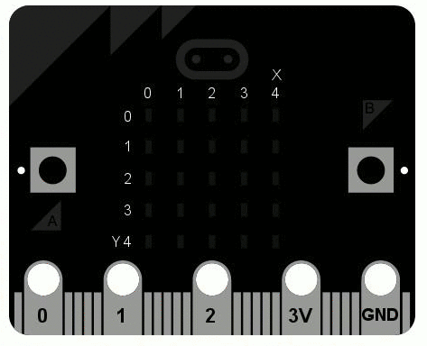

# Hello, World!

Cách thông thường để bắt đầu lập trình bằng một ngôn ngữ mới là ra lệnh cho
máy tính của bạn hiển thị, "Hello, World! ". 



Thật dễ dàng với MicroPython:

```python
from microbit import *
display.scroll("Hello, World!")
```

Mỗi dòng lệnh thực thi một điều đặc biệt nào đó. Dòng lệnh đầu tiên:

```python
from microbit import *
```

... ra lệnh cho MicroPython lấy tất cả những thứ cần thiết để làm việc với BBC 
micro:bit. Tất cả các thứ này nằm trong một mô-đun gọi là `microbit` (một mô-đun 
 là một thư viện của mã có trước đó). Khi bạn `import` (nhập) một cái gì đó tức là bạn đang cho
 MicroPython biết rằng bạn muốn sử dụng nó, và ký hiệu `*` là cách Python nói
 *mọi thứ*. Vì vậy, `from microbit import *` trong tiếng Việt có nghĩa là, "Tôi muốn có thể 
 sử dụng mọi thứ từ thư viện mã lệnh của microbit".

Dòng lệnh thứ hai:

```python
display.scroll ("Hello, World!")
```

...ra lệnh cho MicroPython hãy sử dụng màn hình để di chuyển chuỗi các ký tự
"Hello, World!". Phần `display` của dòng lệnh đó là một *object* từ mô-đun
`microbit` đại diện hiển thị vật lý của thiết bị (chúng ta khai báo là
"object"thay vì " thingy", "whatsit" hoặc "doodah"). Chúng ta có thể ra lệnh cho màn hình 
 làm một vài điều với một dấu chấm `.` theo sau bởi những gì trông giống như một lệnh (thực tế
chúng ta gọi là một *method*). Trong trường hợp này, chúng tôi đang sử dụng phương pháp
`scroll` (`cuộn`). Vì `scroll` cần phải biết những kí tự gì để di chuyển 
đi ngang qua màn hình hiển thị nên chúng ta khai báo chúng giữa dấu nháy kép (`"`)
bên trong dấu ngoặc đơn (`(` và `)`). Chúng được gọi là các *argument* (đối số). Vì vậy,
`display.scroll("Hello, World!") `trong tiếng Việt có nghĩa là, "Tôi muốn bạn sử dụng
màn hình để di chuyển dòng chữ "Hello, World!'". Nếu một method (phương pháp) không cần bất kỳ
đối số nào chúng ta cần khai báo rõ ràng bằng cách sử dụng dấu ngoặc đơn trống như thế này: `()`.

Sao chép file lệnh "Hello, World! " vào chương trình soạn thảo của bạn và ghi (flash) nó vào thiết bị.
Bạn có thể tìm ra cách thay đổi tin báo không? Bạn có thể ra lệnh cho nó nói xin chào bạn không?
Ví dụ, tôi có thể làm cho nó nói "Hello, Nicholas! ". Dưới đây là một manh mối, bạn cần phải 
thay đổi đối số của phương pháp cuộn.

!!! warning "Cảnh báo" 

    Nó có thể không hoạt động. :-)

    Đây là nơi mọi thứ trở nên thú vị và MicroPython cố gắng để hữu dụng. Nếu
    gặp lỗi nó sẽ đưa ra một tin báo hữu ích trên màn hình hiển thị
    của micro:bit. Nếu có thể, nó sẽ cho bạn biết dòng số mấy xuất hiện lỗi.

    Python kỳ vọng bạn gõ ** CHÍNH XÁC** cái mình muốn. Ví dụ,
    ``Microbit``,``microbit`` và ``microBit`` tất cả đều khác nhau đối với
    Python. Nếu MicroPython than phiền ``NameError`` (Sai tên) có thể 
    bởi vì bạn đã gõ cái gì đó không chính xác. Giống như sự khác biệt
    giữa việc đề cập đến "Nicholas " và "Nicolas" vậy. Họ là hai người khác nhau
    nhưng tên của họ rất giống nhau.

    Nếu MicroPython than phiền ``SyntaxError`` đơn giản là bạn đã gõ mã
    theo cách mà MicroPython không thể hiểu. Hãy kiểm tra bạn không thiếu bất kỳ 
    ký tự đặc biệt nào như ``"`` hoặc ``:``. Điều đó giống như đặt dấu chấm. vào
    giữa câu vậy. Thật khó để hiểu ý bạn muốn nói chính xác là gì.

    Microbit có thể ngừng đáp ứng: bạn không thể flash mã mới vào hoặc
    nhập lệnh vào REPL. Nếu điều này xảy ra, hãy thử cấp nguồn điện lại cho nó. Bằng
    cách, tháo cáp USB (và cáp pin nếu nó được kết nối), sau đó cắm
    cáp lại. Bạn có thể cũng cần phải thoát và khởi động lại chương trình
    soạn thảo lệnh.